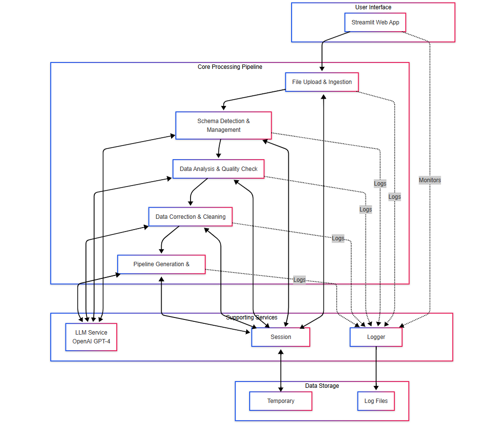
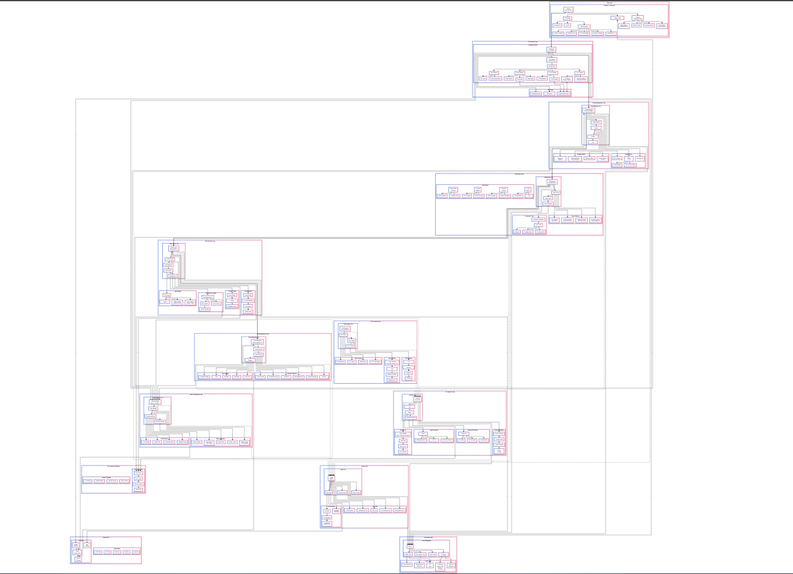

# 🧹 AI-Powered Data Cleaning Platform

An intelligent, automated data cleaning solution that leverages Large Language Models (LLMs) to transform messy datasets into clean, analysis-ready data with minimal manual intervention.

## 📋 Brief Description

This platform combines traditional data cleaning techniques with cutting-edge AI capabilities to automate the entire data preprocessing workflow. It automatically detects data quality issues, generates custom cleaning code using GPT-4, and creates reusable pipelines - all through an intuitive web interface. The system handles CSV, Excel (multi-sheet), JSON, and text files, making it a versatile solution for diverse data cleaning needs. What sets this platform apart is its ability to understand natural language instructions, generate context-aware cleaning strategies, and create production-ready Python pipelines that can be reused across similar datasets.

## 🚀 App Access

**Streamlit Link:** [[(https://genie-iitm.streamlit.app/)]((https://genie-iitm.streamlit.app/))

## 📖 How to Use the App

### Quick Start Guide

1. **Upload Your Data**
   - Click on the file uploader in the main interface
   - Select your file (CSV, Excel, JSON, or TXT)
   - For Excel files with multiple sheets, you'll be prompted to select which sheets to process
   - Files up to 100MB are supported

2. **Configure Settings (Sidebar)**
   - **Processing Mode**: Choose between:
     - *Manual Review*: Review and approve each step
     - *Automatic*: Let AI handle everything with minimal input
   - **LLM Model**: Select your preferred model:
     - *GPT-4*: Most capable, best for complex datasets
     - *GPT-4 Mini*: Faster, suitable for simpler tasks

3. **Schema Detection & Editing**
   - Review the auto-detected schema showing data types for each column
   - **Manual Editing**: Use dropdown menus to change data types
   - **Natural Language Editing**: Type instructions like:
     - "Convert date columns to datetime format"
     - "Make ID column categorical"
     - "Change age to integer and salary to float"
   - Click "Apply Schema" to proceed

4. **Data Quality Analysis**
   - View comprehensive quality metrics:
     - Quality Score (0-100)
     - Missing values analysis
     - Duplicate detection
     - Outlier identification
   - Review AI-generated insights and recommendations
   - Generate interactive visualizations with one click
   - Check the "AI Insights" tab for critical issues

5. **Data Correction**
   - Optionally add custom cleaning instructions in plain English
   - Click "Generate Correction Code" to create AI-powered cleaning code
   - Review the generated Python code and strategy summary
   - Options:
     - ✅ Execute: Run the cleaning code
     - ✏️ Modify: Edit the generated code
     - 🔄 Regenerate: Create new code with different instructions
   - Monitor execution logs and results

6. **Generate Pipeline & Download**
   - Click "Generate Final Pipeline" to create a reusable Python script
   - Download options:
     - **Cleaned Data**: CSV, Excel, or JSON format
     - **Pipeline Script**: Standalone Python file for future use
     - **Complete Package**: Full Python package with tests and documentation
     - **Session Logs**: Complete audit trail in JSON format
     - **Reports**: Excel or text summaries of the cleaning process

### Advanced Features

- **Session Persistence**: Your work is automatically saved - close and resume anytime
- **Error Recovery**: Automatic fallbacks if AI generation fails
- **Batch Processing**: Handle multiple sheets from Excel files
- **Text Processing**: Special NLP features for text data including tokenization and chunking

## 🏗️ Architecture Overview

### System Architecture

The platform employs a modular, pipeline-based architecture with AI enhancement at each stage. Data flows through distinct processing phases, each powered by specialized modules and enhanced with LLM capabilities.

### High-Level Architecture



### Detailed Component Architecture


## 📦 Modules and Purpose

| Module | Purpose | Key Functions |
|--------|---------|---------------|
| **app.py** | Main Streamlit application and UI orchestration | • Session initialization<br/>• UI rendering<br/>• State management<br/>• User interaction handling |
| **file_handler.py** | Multi-format file ingestion and processing | • Format detection<br/>• Encoding handling<br/>• Multi-sheet Excel support<br/>• File validation |
| **schema_manager.py** | Schema detection, validation, and type optimization | • Automatic type detection<br/>• Date format recognition<br/>• Categorical detection<br/>• NL schema editing |
| **data_analyzer.py** | Comprehensive data quality analysis and profiling | • Missing value patterns<br/>• Duplicate detection<br/>• Outlier identification<br/>• Quality scoring |
| **data_corrector.py** | AI-powered cleaning code generation and execution | • Context-aware code generation<br/>• Safe code execution<br/>• Validation & fallbacks<br/>• Strategy summarization |
| **text_processor.py** | Specialized text data cleaning and NLP operations | • Text cleaning templates<br/>• Tokenization & lemmatization<br/>• Pattern detection<br/>• Vector DB preparation |
| **pipeline_generator.py** | Reusable pipeline script generation | • Complete pipeline creation<br/>• Test script generation<br/>• Documentation creation<br/>• Package assembly |
| **llm_client.py** | OpenAI API integration and prompt management | • API communication<br/>• Prompt engineering<br/>• Response parsing<br/>• Token management |
| **session_manager.py** | Session state persistence and recovery | • State serialization<br/>• Auto-save functionality<br/>• Session recovery<br/>• Cleanup management |
| **logger.py** | Comprehensive logging and audit trail | • Operation logging<br/>• Performance metrics<br/>• Error tracking<br/>• Log export |
| **config.py** | Centralized configuration management | • API settings<br/>• Thresholds & limits<br/>• Model configurations<br/>• Prompt templates |

## 🛠️ Technology Used

### Core Technologies
- **Frontend Framework:** Streamlit 1.28+
- **Programming Language:** Python 3.8+
- **Data Processing:** Pandas 1.5+, NumPy 1.24+
- **Statistical Analysis:** SciPy 1.10+
- **Visualization:** Plotly 5.17+, Matplotlib 3.6+, Seaborn 0.12+

### AI/ML Stack
- **LLM Provider:** OpenAI API
- **NLP Library:** NLTK 3.8+
- **Text Processing:** Regular Expressions, Pattern Matching

### File Format Support
- **Spreadsheets:** OpenPyXL 3.1+ (Excel)
- **Data Formats:** CSV, Excel, JSON, TXT
- **Serialization:** Pickle, JSON

### Development Tools
- **Environment Management:** python-dotenv
- **HTTP Client:** Requests 2.31+
- **Code Analysis:** AST (Abstract Syntax Tree)

## 📁 Project File System Structure

```
DATA VALIDATOR/
├── app.py                    # Main application entry point
├── config.py                 # Configuration settings
├── file_handler.py           # File processing utilities
├── schema_manager.py         # Schema detection and management
├── data_analyzer.py          # Data quality analysis
├── data_corrector.py         # Data correction logic
├── text_processor.py         # Text-specific processing
├── pipeline_generator.py     # Pipeline code generation
├── llm_client.py            # LLM integration
├── session_manager.py        # Session management
├── logger.py                # Logging utilities
├── requirements.txt         # Python dependencies
├── README.md               # Project documentation
├── uploads/                # Temporary file storage
├── temp/                   # Session data storage
├── logs/                   # Application logs
└── outputs/                # Generated pipelines
```

## 💻 Local Setup

### Prerequisites
- Python 3.8 or higher
- pip package manager
- OpenAI API key

### Installation Steps

```bash
# 1. Clone the repository
git clone https://github.com/cosmoavijeet07/automatic-data-validator.git

# 2. Create and activate virtual environment
python -m venv venv

# On Windows
venv\Scripts\activate

# On macOS/Linux
source venv/bin/activate

# 3. Install dependencies
pip install -r requirements.txt

# 4. Set up environment variables
# Create a .env file in the root directory
echo "OPENAI_API_KEY=your-api-key-here" > .env

# 5. Run the application
streamlit run app.py

# The app will open in your browser at http://localhost:8501
```

### Configuration
Edit `config.py` to customize:
- File size limits (default: 100MB)
- Quality thresholds
- Model preferences
- Prompts
- Processing timeouts

## ✨ Key Features

### Core Capabilities
- **🤖 AI-Powered Code Generation**: Automatically generates context-aware Python cleaning code using GPT-4
- **📊 Multi-Format Support**: Seamlessly handles CSV, Excel (with multi-sheet support), JSON, and text files
- **🔍 Intelligent Schema Detection**: Auto-detects optimal data types with customizable thresholds
- **💬 Natural Language Interface**: Edit schemas and provide cleaning instructions in plain English
- **📈 Comprehensive Analysis**: Detailed quality reports with interactive Plotly visualizations
- **🔄 Reusable Pipelines**: Generates production-ready, documented Python scripts

### Advanced Features
- **💾 Session Persistence**: Auto-saves progress with 24-hour session recovery
- **📝 Complete Audit Trail**: Detailed logging of all operations with export capabilities
- **⚡ Processing Modes**: Choose between careful manual review or fully automated processing
- **🎯 Smart Fallbacks**: Robust error handling with automatic fallback to rule-based cleaning
- **🧪 Code Validation**: AST-based code validation ensures safe execution
- **📦 Package Generation**: Creates complete Python packages with tests and documentation

### Quality Assurance
- **Multi-stage Validation**: Code validation at generation, compilation, and execution
- **Sandboxed Execution**: Safe code execution environment with output capture
- **Performance Monitoring**: Real-time metrics and execution time tracking
- **Error Recovery**: Automatic retry with exponential backoff for API calls

## 💡 Usage Tips

### Best Practices
1. **Start with a Sample**: Test with 1000-5000 rows first to verify cleaning strategy
2. **Review Generated Code**: Always inspect AI-generated code before execution
3. **Use Natural Language**: Describe your needs clearly - the AI understands context
4. **Save Your Pipeline**: Export the pipeline script for reuse on similar datasets
5. **Check Quality Scores**: Aim for quality scores above 75 before finalizing

### Performance Optimization
- **Large Files**: Consider chunking files over 50MB
- **Complex Operations**: Use automatic mode for faster processing
- **Multiple Files**: Process similar files using exported pipelines

### Troubleshooting
- **API Errors**: Check your OpenAI API key and rate limits
- **Memory Issues**: Reduce file size or use sampling
- **Session Recovery**: Use the session ID from the sidebar to recover work

## 🚀  What's New


#### 🧠 Contextual AI Understanding
- The platform doesn't just apply generic cleaning rules - it understands your specific data context
- Generates tailored cleaning strategies based on actual data patterns and quality issues
- Learns from the data structure to suggest optimal transformations

#### 🔄 Adaptive Prompt Engineering
- Dynamic prompt generation that includes complete data context
- Prompts are enhanced with schema information, quality metrics, and user instructions
- Token-aware chunking ensures optimal use of LLM context windows

#### 🛡️ Multi-Stage Validation System
- **Generation Stage**: Validates prompt completeness and context
- **Compilation Stage**: AST parsing ensures syntactic correctness
- **Execution Stage**: Sandboxed environment with comprehensive error handling
- Safety checks for blocked functions and unauthorized imports

#### 💬 Natural Language Schema Editing
- First-of-its-kind interface for schema modifications using plain English
- Understands complex instructions like "normalize all date formats and convert percentages to decimals"
- Context-aware suggestions based on data patterns

#### 📦 Complete Pipeline Packaging
- Generates not just code but entire Python packages
- Includes unit tests, documentation, requirements.txt, and setup.py
- Creates production-ready solutions that can be deployed immediately

#### 📊 Real-time Quality Scoring
- Dynamic quality metrics that update as you clean
- Comprehensive scoring algorithm considering multiple factors
- Visual feedback on quality improvements at each stage

#### 🔍 Intelligent Pattern Detection
- Identifies missing value patterns and correlations
- Detects encoding issues and mixed data types
- Recognizes date formats across multiple standards

#### 🚅 Vector Database Preparation
- Built-in text chunking for RAG applications
- Configurable chunk size and overlap
- Metadata generation for each chunk


#### Custom Serialization
- NumpyJSONEncoder handles complex data types
- Safe serialization of Pandas DataFrames and NumPy arrays
- Preserves data integrity across session saves

#### Sandboxed Execution
- Isolated execution environment for generated code
- Controlled imports and function access
- Output capture and error isolation

#### Token Management
- Intelligent prompt chunking for large contexts
- Token counting and optimization
- Automatic fallback for token limit exceeded errors

#### Session Architecture
- UUID-based session identification
- Automatic cleanup of expired sessions
- Backup and restore capabilities

#### Parallel Processing
- Asynchronous logging that doesn't block main operations
- Concurrent visualization generation
- Efficient memory management for large datasets


## 👤 Author & Team


| **Student Email ID**               | **Team Member**         |
|------------------------------------|-------------------------|
| 21f3002602@ds.study.iitm.ac.in     | **Mahi Mudgal**         |
| 21f2001140@ds.study.iitm.ac.in     | **Syed Afrin Gowhar**   |
| 23f1000403@ds.study.iitm.ac.in     | **Raunak Pugalia**      |
| 21f3002037@ds.study.iitm.ac.in     | **Sharda**              |
| 21f1005675@ds.study.iitm.ac.in     | **Avijeet Palit**       |   
 


**Team Name:** 🧞‍♂️ GENIE

---

*This platform represents a significant advancement in automated data preprocessing, combining the reliability of traditional methods with the intelligence of modern AI. It's designed to save data scientists and analysts hours of manual cleaning work while maintaining full control and transparency over the cleaning process.*
